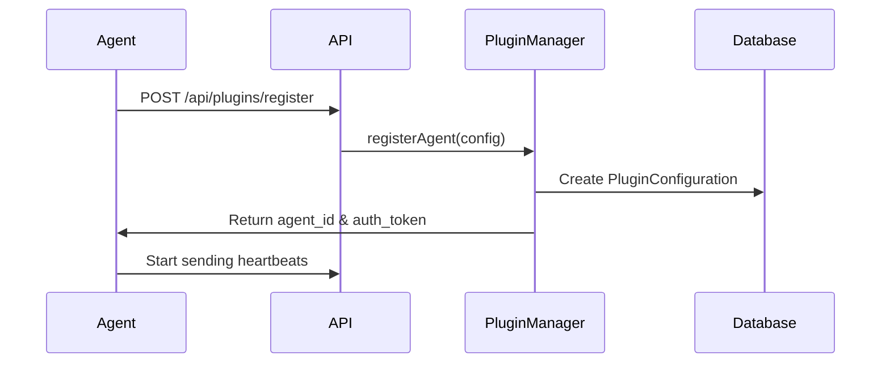
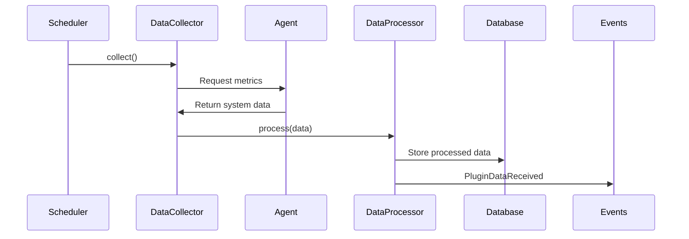
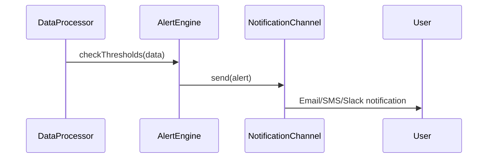

# SSL Monitor v4 - Plugin Architecture Documentation

## 📋 Overview

This document defines the plugin architecture for SSL Monitor v4, designed to support the v1.1.0 agent system for collecting system metrics (HDD space, memory, CPU, etc.) while maintaining the proven SSL monitoring foundation.

**Architecture Philosophy**:
- **v4.0**: Focus on proven SSL monitoring with plugin-ready foundation
- **v1.1.0**: Drop-in agent system with minimal refactoring
- **Future**: Extensible for any monitoring plugin type

---

## 🏗️ Architecture Components

### 1. Plugin Types

#### **Agents** (`plugin_type: 'agent'`)
- **Purpose**: Collect system metrics from remote servers/services
- **Examples**: `system_metrics_agent`, `disk_space_monitor`, `memory_monitor`
- **Communication**: HTTP API, WebSocket, or message queues
- **Data Types**: CPU usage, memory usage, disk space, network metrics, process monitoring

#### **Webhooks** (`plugin_type: 'webhook'`)
- **Purpose**: Receive data from external services
- **Examples**: `github_webhook`, `monitoring_service_webhook`
- **Communication**: Incoming HTTP POST requests
- **Data Types**: Event notifications, service status updates

#### **External Services** (`plugin_type: 'external_service'`)
- **Purpose**: Pull data from third-party APIs
- **Examples**: `uptime_robot_integration`, `pingdom_integration`
- **Communication**: Outbound API calls
- **Data Types**: Service status, performance metrics, alerts

---

## 🔌 Core Interfaces

### DataCollectorInterface

```php
<?php

namespace App\Contracts;

/**
 * Universal interface for all data collection sources
 * Enables unified data pipeline for SSL checks, agents, and external services
 */
interface DataCollectorInterface
{
    /**
     * Collect data with optional configuration
     * @param array $config Runtime configuration parameters
     * @return array Collected data in standardized format
     */
    public function collect(array $config = []): array;

    /**
     * Validate data source connectivity and configuration
     * @return bool True if source is reachable and properly configured
     */
    public function validate(): bool;

    /**
     * Get collector capabilities (metrics it can collect)
     * @return array List of supported data types/metrics
     */
    public function getCapabilities(): array;

    /**
     * Get configuration schema for this collector
     * @return array JSON schema for configuration validation
     */
    public function getConfigurationSchema(): array;

    /**
     * Get collector type identifier
     * @return string 'ssl_monitor', 'agent', 'webhook', 'external_service'
     */
    public function getCollectorType(): string;

    /**
     * Get collector name (unique identifier)
     * @return string e.g., 'system_metrics_agent', 'disk_space_monitor'
     */
    public function getCollectorName(): string;

    /**
     * Get collector version for compatibility checking
     * @return string Semantic version string
     */
    public function getVersion(): string;

    /**
     * Set collector configuration
     * @param array $config Configuration parameters
     */
    public function setConfiguration(array $config): void;

    /**
     * Get timestamp of last successful collection
     * @return \DateTime|null Last collection time or null if never collected
     */
    public function getLastCollectionAt(): ?\DateTime;

    /**
     * Get collector health status and diagnostics
     * @return array Health status with metrics and error information
     */
    public function getHealthStatus(): array;
}
```

### AgentCommunicatorInterface

```php
<?php

namespace App\Contracts;

/**
 * Interface for communicating with monitoring agents
 * Supports various communication protocols (HTTP, WebSocket, message queues)
 */
interface AgentCommunicatorInterface
{
    /**
     * Send configuration to agent
     * @param string $agentId Unique agent identifier
     * @param array $config Configuration to send
     * @return bool Success status
     */
    public function sendConfiguration(string $agentId, array $config): bool;

    /**
     * Request data collection from agent
     * @param string $agentId Agent identifier
     * @param array $metrics Specific metrics to collect (empty = all)
     * @return array Collected data
     */
    public function requestCollection(string $agentId, array $metrics = []): array;

    /**
     * Check agent health and connectivity
     * @param string $agentId Agent identifier
     * @return array Health status and diagnostics
     */
    public function checkHealth(string $agentId): array;

    /**
     * Get agent capabilities
     * @param string $agentId Agent identifier
     * @return array List of supported metrics and capabilities
     */
    public function getCapabilities(string $agentId): array;

    /**
     * Register new agent with the system
     * @param array $agentConfig Agent configuration
     * @return string Assigned agent ID
     */
    public function registerAgent(array $agentConfig): string;

    /**
     * Unregister agent from system
     * @param string $agentId Agent identifier
     * @return bool Success status
     */
    public function unregisterAgent(string $agentId): bool;

    /**
     * Get list of all active agents
     * @return array Active agent information
     */
    public function getActiveAgents(): array;

    /**
     * Send command to agent (restart, update, configure)
     * @param string $agentId Agent identifier
     * @param string $command Command to execute
     * @param array $params Command parameters
     * @return array Command execution result
     */
    public function sendCommand(string $agentId, string $command, array $params = []): array;

    /**
     * Retrieve agent logs for debugging
     * @param string $agentId Agent identifier
     * @param int $lines Number of log lines to retrieve
     * @return array Log entries
     */
    public function getAgentLogs(string $agentId, int $lines = 100): array;

    /**
     * Update agent software version
     * @param string $agentId Agent identifier
     * @param string|null $version Target version (null = latest)
     * @return bool Update success status
     */
    public function updateAgent(string $agentId, string $version = null): bool;
}
```

---

## 🗄️ Database Schema

### Plugin Configuration Table

```sql
CREATE TABLE `plugin_configurations` (
  `id` bigint unsigned NOT NULL AUTO_INCREMENT,
  `user_id` bigint unsigned NOT NULL,

  -- Plugin identification
  `plugin_type` varchar(255) NOT NULL, -- 'agent', 'webhook', 'external_service'
  `plugin_name` varchar(255) NOT NULL, -- 'system_metrics_agent', 'disk_space_monitor'
  `plugin_version` varchar(255) NOT NULL DEFAULT '1.0.0',

  -- Configuration (JSON)
  `configuration` json NOT NULL, -- Plugin-specific settings
  `authentication` json NULL,    -- Encrypted API keys, tokens, certificates
  `endpoints` json NULL,         -- Communication endpoints

  -- Status and health
  `is_enabled` tinyint(1) NOT NULL DEFAULT '1',
  `last_contacted_at` timestamp NULL,
  `status` varchar(255) NOT NULL DEFAULT 'pending', -- pending, active, error, disabled
  `status_message` text NULL,

  -- Data collection settings
  `collection_schedule` json NULL, -- Cron expressions
  `data_retention` json NULL,      -- Retention policies
  `alert_thresholds` json NULL,    -- Alert rules

  -- Metadata
  `description` varchar(255) NULL,
  `capabilities` json NULL,        -- Supported metrics/features
  `metadata` json NULL,           -- Additional plugin metadata

  `created_at` timestamp NULL,
  `updated_at` timestamp NULL,

  PRIMARY KEY (`id`),
  KEY `plugin_configurations_user_id_index` (`user_id`),
  KEY `plugin_configurations_plugin_type_plugin_name_index` (`plugin_type`,`plugin_name`),
  KEY `plugin_configurations_is_enabled_index` (`is_enabled`),
  KEY `plugin_configurations_status_index` (`status`),
  UNIQUE KEY `plugin_configurations_user_id_plugin_type_plugin_name_unique` (`user_id`,`plugin_type`,`plugin_name`),
  CONSTRAINT `plugin_configurations_user_id_foreign` FOREIGN KEY (`user_id`) REFERENCES `users` (`id`) ON DELETE CASCADE
);
```

### Enhanced Core Tables (Plugin-Ready)

#### Websites Table Extensions
```sql
-- Plugin-ready extensions to websites table
`monitoring_config` json NULL,              -- Plugin-configurable monitoring settings
`ssl_monitoring_enabled` tinyint(1) NOT NULL DEFAULT '1',
`uptime_monitoring_enabled` tinyint(1) NOT NULL DEFAULT '0',
`plugin_data` json NULL                     -- Extensible data for future plugins
```

#### SSL Checks Table Extensions
```sql
-- Plugin-ready extensions to ssl_checks table
`check_metrics` json NULL,                  -- Performance, response time metrics
`check_source` varchar(255) NOT NULL DEFAULT 'ssl_monitor', -- 'ssl_monitor', 'agent', 'external_service'
`agent_data` json NULL,                     -- Agent-collected system metrics during check
`security_analysis` json NULL               -- Extended security checks from plugins
```

---

## 🔄 Data Flow Architecture

### 1. Agent Registration Flow



### 2. Data Collection Flow



### 3. Alert Flow



---

## 📡 Communication Protocols

### HTTP API Endpoints (v1.1.0)

#### Agent Registration
```http
POST /api/plugins/register
Content-Type: application/json

{
  "plugin_type": "agent",
  "plugin_name": "system_metrics_agent",
  "plugin_version": "1.0.0",
  "capabilities": ["cpu", "memory", "disk", "network"],
  "configuration": {
    "collection_interval": 300,
    "metrics": ["cpu_usage", "memory_usage", "disk_usage"]
  },
  "endpoints": {
    "health_check": "http://agent-server:8080/health",
    "data_collection": "http://agent-server:8080/collect"
  }
}
```

#### Data Submission
```http
POST /api/plugins/{plugin_id}/data
Authorization: Bearer {auth_token}
Content-Type: application/json

{
  "timestamp": "2025-09-20T10:00:00Z",
  "data_type": "system_metrics",
  "data": {
    "cpu_usage": 45.2,
    "memory_usage": 78.5,
    "disk_usage": {
      "/": 65.0,
      "/var": 82.3
    },
    "network": {
      "bytes_in": 1024000,
      "bytes_out": 512000
    }
  },
  "metadata": {
    "hostname": "web-server-01",
    "agent_version": "1.0.0"
  }
}
```

### WebSocket Protocol (Real-time)

#### Connection
```javascript
// Agent connects to WebSocket
const ws = new WebSocket('wss://ssl-monitor.com/ws/plugins/{plugin_id}');
ws.send(JSON.stringify({
  type: 'authenticate',
  token: 'auth_token_here'
}));
```

#### Real-time Data Streaming
```javascript
// Agent sends real-time metrics
ws.send(JSON.stringify({
  type: 'data',
  timestamp: new Date().toISOString(),
  metrics: {
    cpu_usage: 67.8,
    memory_usage: 82.1
  }
}));
```

---

## 🎯 Plugin Implementation Examples

### System Metrics Agent (Python)

```python
# system_metrics_agent.py
import psutil
import requests
import time
import json
from datetime import datetime

class SystemMetricsAgent:
    def __init__(self, ssl_monitor_url, auth_token):
        self.ssl_monitor_url = ssl_monitor_url
        self.auth_token = auth_token
        self.plugin_id = None

    def register(self):
        """Register agent with SSL Monitor"""
        config = {
            "plugin_type": "agent",
            "plugin_name": "system_metrics_agent",
            "plugin_version": "1.0.0",
            "capabilities": ["cpu", "memory", "disk", "network"],
            "configuration": {
                "collection_interval": 300,
                "metrics": ["cpu_usage", "memory_usage", "disk_usage"]
            }
        }

        response = requests.post(
            f"{self.ssl_monitor_url}/api/plugins/register",
            json=config,
            headers={"Authorization": f"Bearer {self.auth_token}"}
        )

        if response.status_code == 201:
            self.plugin_id = response.json()["plugin_id"]
            return True
        return False

    def collect_metrics(self):
        """Collect system metrics"""
        return {
            "timestamp": datetime.utcnow().isoformat() + "Z",
            "data_type": "system_metrics",
            "data": {
                "cpu_usage": psutil.cpu_percent(interval=1),
                "memory_usage": psutil.virtual_memory().percent,
                "disk_usage": {
                    mount.mountpoint: psutil.disk_usage(mount.mountpoint).percent
                    for mount in psutil.disk_partitions()
                },
                "network": {
                    "bytes_sent": psutil.net_io_counters().bytes_sent,
                    "bytes_recv": psutil.net_io_counters().bytes_recv
                }
            },
            "metadata": {
                "hostname": psutil.os.uname().nodename,
                "agent_version": "1.0.0"
            }
        }

    def send_data(self, metrics):
        """Send metrics to SSL Monitor"""
        response = requests.post(
            f"{self.ssl_monitor_url}/api/plugins/{self.plugin_id}/data",
            json=metrics,
            headers={"Authorization": f"Bearer {self.auth_token}"}
        )
        return response.status_code == 200

    def run(self):
        """Main agent loop"""
        if not self.register():
            print("Failed to register agent")
            return

        while True:
            try:
                metrics = self.collect_metrics()
                if self.send_data(metrics):
                    print(f"Sent metrics at {metrics['timestamp']}")
                else:
                    print("Failed to send metrics")
                time.sleep(300)  # 5 minutes
            except Exception as e:
                print(f"Error: {e}")
                time.sleep(60)

# Usage
agent = SystemMetricsAgent("https://ssl-monitor.com", "your_auth_token")
agent.run()
```

### Disk Space Monitor Agent (Node.js)

```javascript
// disk_monitor_agent.js
const fs = require('fs');
const os = require('os');
const axios = require('axios');

class DiskMonitorAgent {
    constructor(sslMonitorUrl, authToken) {
        this.sslMonitorUrl = sslMonitorUrl;
        this.authToken = authToken;
        this.pluginId = null;
    }

    async register() {
        const config = {
            plugin_type: "agent",
            plugin_name: "disk_space_monitor",
            plugin_version: "1.0.0",
            capabilities: ["disk_space", "disk_io", "file_system"],
            configuration: {
                collection_interval: 600, // 10 minutes
                alert_threshold: 90, // Alert when disk usage > 90%
                monitored_paths: ["/", "/var", "/home"]
            }
        };

        try {
            const response = await axios.post(
                `${this.sslMonitorUrl}/api/plugins/register`,
                config,
                { headers: { Authorization: `Bearer ${this.authToken}` } }
            );

            this.pluginId = response.data.plugin_id;
            return true;
        } catch (error) {
            console.error('Registration failed:', error);
            return false;
        }
    }

    async collectDiskMetrics() {
        const metrics = {
            timestamp: new Date().toISOString(),
            data_type: "disk_metrics",
            data: {
                disk_usage: {},
                disk_io: {},
                file_system_info: {}
            },
            metadata: {
                hostname: os.hostname(),
                platform: os.platform(),
                agent_version: "1.0.0"
            }
        };

        // Collect disk usage for monitored paths
        const paths = ["/", "/var", "/home"];
        for (const path of paths) {
            try {
                const stats = fs.statSync(path);
                if (stats.isDirectory()) {
                    const usage = await this.getDiskUsage(path);
                    metrics.data.disk_usage[path] = usage;
                }
            } catch (error) {
                console.error(`Error checking ${path}:`, error);
            }
        }

        return metrics;
    }

    async getDiskUsage(path) {
        // Simplified disk usage calculation
        // In production, use proper disk space libraries
        return {
            total: 1000000000, // 1GB in bytes
            used: 650000000,   // 650MB used
            available: 350000000, // 350MB available
            usage_percent: 65.0
        };
    }

    async sendMetrics(metrics) {
        try {
            const response = await axios.post(
                `${this.sslMonitorUrl}/api/plugins/${this.pluginId}/data`,
                metrics,
                { headers: { Authorization: `Bearer ${this.authToken}` } }
            );
            return response.status === 200;
        } catch (error) {
            console.error('Failed to send metrics:', error);
            return false;
        }
    }

    async run() {
        if (!await this.register()) {
            console.error('Failed to register agent');
            return;
        }

        console.log('Disk Monitor Agent started');

        setInterval(async () => {
            try {
                const metrics = await this.collectDiskMetrics();
                if (await this.sendMetrics(metrics)) {
                    console.log(`Sent disk metrics at ${metrics.timestamp}`);
                } else {
                    console.error('Failed to send metrics');
                }
            } catch (error) {
                console.error('Error in collection cycle:', error);
            }
        }, 600000); // 10 minutes
    }
}

// Usage
const agent = new DiskMonitorAgent('https://ssl-monitor.com', 'your_auth_token');
agent.run();
```

---

## 🔐 Security Considerations

### Authentication & Authorization

1. **API Token Authentication**
   ```php
   // Plugin API tokens with specific permissions
   $token = PluginToken::create([
       'plugin_id' => $plugin->id,
       'permissions' => ['data.submit', 'health.report'],
       'expires_at' => now()->addYear(),
   ]);
   ```

2. **Encrypted Configuration Storage**
   ```php
   // Sensitive data encryption in PluginConfiguration
   protected function casts(): array
   {
       return [
           'authentication' => 'encrypted:array', // API keys, certificates
           'configuration' => 'array',
       ];
   }
   ```

3. **Rate Limiting**
   ```php
   // Rate limiting for plugin endpoints
   Route::middleware(['throttle:plugin-data:60,1'])->group(function () {
       Route::post('/api/plugins/{plugin}/data', [PluginController::class, 'receiveData']);
   });
   ```

### Data Validation

```php
// Plugin data validation rules
class PluginDataRequest extends FormRequest
{
    public function rules(): array
    {
        return [
            'timestamp' => 'required|date|before_or_equal:now',
            'data_type' => 'required|string|in:system_metrics,disk_metrics,network_metrics',
            'data' => 'required|array',
            'metadata' => 'sometimes|array',
            'metadata.hostname' => 'required|string|max:255',
            'metadata.agent_version' => 'required|string|regex:/^\d+\.\d+\.\d+$/',
        ];
    }
}
```

---

## 📊 Monitoring & Observability

### Plugin Health Monitoring

```php
// Plugin health check implementation
class PluginHealthService
{
    public function checkPluginHealth(PluginConfiguration $plugin): array
    {
        $health = [
            'plugin_id' => $plugin->id,
            'status' => $plugin->status,
            'last_contact' => $plugin->last_contacted_at,
            'health_score' => 0,
            'issues' => [],
        ];

        // Check last contact time
        if ($plugin->last_contacted_at && $plugin->last_contacted_at->diffInMinutes() > 30) {
            $health['issues'][] = 'No contact for over 30 minutes';
            $health['health_score'] -= 30;
        }

        // Check data quality
        $recentData = $plugin->getRecentData();
        if (empty($recentData)) {
            $health['issues'][] = 'No recent data received';
            $health['health_score'] -= 25;
        }

        // Calculate final health score
        $health['health_score'] = max(0, 100 + $health['health_score']);

        return $health;
    }
}
```

### Metrics Dashboard

```php
// Plugin metrics aggregation
class PluginMetricsService
{
    public function getPluginMetrics(int $userId): array
    {
        return [
            'total_plugins' => PluginConfiguration::where('user_id', $userId)->count(),
            'active_plugins' => PluginConfiguration::where('user_id', $userId)->active()->count(),
            'agents' => PluginConfiguration::where('user_id', $userId)->agents()->count(),
            'webhooks' => PluginConfiguration::where('user_id', $userId)->webhooks()->count(),
            'external_services' => PluginConfiguration::where('user_id', $userId)->externalServices()->count(),
            'health_summary' => $this->getHealthSummary($userId),
            'data_volume' => $this->getDataVolume($userId),
        ];
    }
}
```

---

## 🚀 Implementation Timeline

### Phase 1 (v4.0) - ✅ COMPLETED
- [x] Plugin-ready database schema
- [x] Core models with plugin interfaces
- [x] Service contracts design
- [x] Event-driven architecture
- [x] Basic plugin configuration model

### Phase 2 (v1.1.0) - PLANNED
- [ ] Agent communication API endpoints
- [ ] Plugin manager service implementation
- [ ] Data processor pipeline
- [ ] Real-time WebSocket connections
- [ ] Plugin health monitoring
- [ ] Agent SDK (Python, Node.js, Go)

### Phase 3 (v1.2.0) - FUTURE
- [ ] Plugin marketplace
- [ ] Advanced analytics dashboard
- [ ] Custom plugin development tools
- [ ] Enterprise plugin features

---

## 📚 Reference Links

- **API Documentation**: `/docs/api/plugins` (v1.1.0)
- **Agent SDK**: `https://github.com/ssl-monitor/agent-sdk` (v1.1.0)
- **Plugin Examples**: `/examples/plugins/` (v1.1.0)
- **Configuration Schema**: `/docs/configuration-schema.json` (v1.1.0)

---

*This documentation serves as the definitive guide for implementing the plugin system in SSL Monitor v1.1.0 and beyond.*