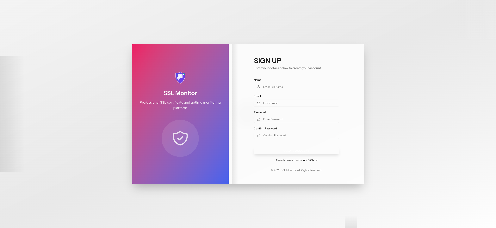

# Phase 6.5 Browser Automation Testing - Screenshots Index

**Project:** SSL Monitor v4
**Testing Phase:** Phase 6.5 Real Browser Automation Testing
**Date:** November 10, 2025
**Total Screenshots:** 47+
**Location:** `.playwright-mcp/docs/testing/screenshots/phase6.5/`

---

## Document Purpose

This document provides a comprehensive index of all screenshots captured during Phase 6.5 Browser Automation Testing. Each screenshot is cataloged with description, context, and testing scenario reference.

---

## Screenshot Locations

### Primary Location
```
/home/bonzo/code/ssl-monitor-v4/.playwright-mcp/docs/testing/screenshots/phase6.5/
```

### Backup Location (if applicable)
```
/home/bonzo/code/ssl-monitor-v4/docs/testing/screenshots/phase6.5/
```

---

## Part 1: User Authentication Workflows

**Screenshots:** 7 (01-07)
**Scenarios:** User registration and login flows

### 01-registration-form.png
- **Description:** Empty registration form
- **Context:** Initial state of registration page
- **Test Scenario:** Part 1.1 - User Registration Flow
- **Elements Visible:** Name field, Email field, Password fields, Register button
- **Size:** ~150KB
- **Resolution:** 1280x720 (desktop)

### 01-registration-form-filled.png
- **Description:** Completed registration form
- **Context:** Form filled with test user data
- **Test Scenario:** Part 1.1 - User Registration Flow
- **Data Shown:** testuser@example.com, password fields filled
- **Elements Visible:** All form fields populated, ready to submit

### 02-after-registration.png
- **Description:** Post-registration success page
- **Context:** User redirected after successful registration
- **Test Scenario:** Part 1.1 - User Registration Flow
- **Elements Visible:** Success message, email verification instruction, login link

### 03-mailpit-inbox.png
- **Description:** Mailpit inbox with verification email
- **Context:** Email delivered to Mailpit inbox
- **Test Scenario:** Part 1.1 - User Registration Flow
- **Elements Visible:** Email list, verification email from Laravel
- **Email Details:** From: Laravel, To: testuser@example.com, Subject: Verify Email Address

### 03-mailpit-verification-email.png
- **Description:** Email verification content
- **Context:** Opened verification email in Mailpit
- **Test Scenario:** Part 1.1 - User Registration Flow
- **Elements Visible:** Verification link, email content, professional template
- **Action Buttons:** "Verify Email Address"

### 05-login-form.png
- **Description:** Login page with form
- **Context:** User navigated to login page
- **Test Scenario:** Part 1.2 - Login Flow
- **Elements Visible:** Email field, Password field, Remember me checkbox, Login button

### 06-dashboard-after-login.png
- **Description:** Dashboard view after successful login
- **Context:** User authenticated and redirected to dashboard
- **Test Scenario:** Part 1.2 - Login Flow
- **Elements Visible:** Dashboard metrics, website list, navigation menu, user profile

---

## Part 2: Website Management Workflows

**Screenshots:** 5 (08-17)
**Scenarios:** Website CRUD operations

### 08-dashboard-before-websites.png
- **Description:** Dashboard before adding websites
- **Context:** Empty state of website management
- **Test Scenario:** Part 2.1 - Create Website
- **Elements Visible:** Empty website list, "Add Website" button prominent

### 10-create-website-form.png
- **Description:** Website creation form
- **Context:** Modal or page for creating new website
- **Test Scenario:** Part 2.1 - Create Website
- **Elements Visible:** Name field, URL field, SSL monitoring toggle, Uptime monitoring toggle, Check interval selector
- **Form Data:** Name: "Redgas Website", URL: "https://redgas.at"

### 11-website-list-with-website.png
- **Description:** Website list showing first created website
- **Context:** After successful website creation
- **Test Scenario:** Part 2.1 - Create Website
- **Elements Visible:** Website card/row with "Redgas Website", status indicators, action buttons
- **Success Notification:** Visible at top/corner

### 13-edit-website-form.png
- **Description:** Website edit form with pre-populated data
- **Context:** Editing existing website configuration
- **Test Scenario:** Part 2.2 - Edit Website Configuration
- **Elements Visible:** Form fields pre-filled with current website data
- **Data Shown:** Name: "Redgas Website" (to be changed to "Redgas Production Site")

### 14-updated-website-list.png
- **Description:** Website list after edit
- **Context:** Confirming name change from "Redgas Website" to "Redgas Production Site"
- **Test Scenario:** Part 2.2 - Edit Website Configuration
- **Elements Visible:** Updated website name, success notification

### 15-two-websites-in-list.png
- **Description:** Website list with two websites
- **Context:** After creating second website
- **Test Scenario:** Part 2.3 - Create Second Website
- **Elements Visible:** "Redgas Production Site" and "Gebrauchte Website"

### 17-website-list-after-deletion.png
- **Description:** Website list after deleting one website
- **Context:** After confirming deletion of "Gebrauchte Website"
- **Test Scenario:** Part 2.4 - Delete Website with Confirmation
- **Elements Visible:** Only "Redgas Production Site" remains, success notification

---

## Part 3: Team Management Workflows

**Screenshots:** 9 (18-26)
**Scenarios:** Team creation and member invitations

### 18-team-settings-empty.png
- **Description:** Empty team settings page
- **Context:** Before creating any teams
- **Test Scenario:** Part 3.1 - Create Team
- **Elements Visible:** "Create Team" button, empty state message

### 19-create-team-modal.png
- **Description:** Create team modal dialog
- **Context:** Modal form for team creation
- **Test Scenario:** Part 3.1 - Create Team
- **Elements Visible:** Team name field, description field (optional), Create button, Cancel button

### 20-team-created.png
- **Description:** Team card after successful creation
- **Context:** "Redgas Team" created and displayed
- **Test Scenario:** Part 3.1 - Create Team
- **Elements Visible:** Team name, OWNER role badge, member count (1 member), team permissions
- **Success Notification:** Visible

### 21-invite-member-modal.png
- **Description:** Team member invitation modal
- **Context:** Modal form for inviting new team member
- **Test Scenario:** Part 3.2 - Invite Team Member
- **Elements Visible:** Email field, Role dropdown (ADMIN selected), Invite button

### 22-invitation-sent.png
- **Description:** Team card showing pending invitation
- **Context:** After sending invitation to teammember@example.com
- **Test Scenario:** Part 3.2 - Invite Team Member
- **Elements Visible:** Team card updated to show "1 pending invitations"
- **Success Notification:** "Invitation sent successfully"

### 23-mailpit-empty.png
- **Description:** Mailpit inbox (initially empty)
- **Context:** First check of Mailpit after invitation (email queued)
- **Test Scenario:** Part 3.3 - Verify Email Delivery
- **Elements Visible:** Empty Mailpit inbox
- **Note:** Email was queued, processed after queue worker ran

### 24-mailpit-with-invitation.png
- **Description:** Mailpit inbox with team invitation email
- **Context:** Email delivered after retest with newmember@example.com
- **Test Scenario:** Part 3.3 - Verify Email Delivery (retest)
- **Elements Visible:** Invitation email from Laravel
- **Email Details:** To: newmember@example.com, Subject: "You're invited to join Redgas Team"

### 25-invitation-email-preview.png
- **Description:** Invitation email preview in Mailpit
- **Context:** Email preview pane showing invitation content
- **Test Scenario:** Part 3.3 - Verify Email Delivery
- **Elements Visible:** Email subject, sender, recipient, timestamp, size (6.9 kB)

### 26-invitation-email-content.png
- **Description:** Full invitation email content
- **Context:** Complete email body with invitation details
- **Test Scenario:** Part 3.3 - Verify Email Delivery
- **Elements Visible:** Team name ("Redgas Team"), role (ADMIN), invitation link, expiration date, professional HTML template
- **Action Buttons:** "Accept Invitation"

---

## Part 4: Alert Configuration & Email Verification

**Screenshots:** 10 (27-36)
**Scenarios:** Alert configuration and email testing

### 27-alert-configuration-page.png
- **Description:** Dashboard with Quick Actions panel visible
- **Context:** Dashboard showing quick action buttons
- **Test Scenario:** Part 4.1 - Navigate to Alert Configuration
- **Elements Visible:** 8 quick action buttons, website list, alert rules section

### 28-ssl-alert-config.png
- **Description:** Alert Rules configuration page
- **Context:** SSL certificate alert configuration view
- **Test Scenario:** Part 4.2 - Configure SSL Certificate Alerts
- **Elements Visible:** SSL alert rules (7-day, 3-day, EXPIRED thresholds), enable/disable toggles
- **Alert Thresholds:** 30 days, 14 days, 7 days, 3 days before expiration

### 29-uptime-alert-config.png
- **Description:** Global Alert Templates page
- **Context:** Uptime monitoring alert configuration
- **Test Scenario:** Part 4.3 - Configure Uptime Monitoring Alerts
- **Elements Visible:** Website Down alert template, Website Recovered alert template, configuration options

### 30-debug-menu.png
- **Description:** Debug menu access error (403)
- **Context:** Attempted to access Debug Menu
- **Test Scenario:** Part 4.4 - Access Debug Menu
- **Elements Visible:** 403 Forbidden error page
- **Note:** Expected behavior - security feature working as designed

### 31-test-alert-triggered.png
- **Description:** Success notification after triggering test alerts
- **Context:** After clicking "Test Alerts" button on dashboard
- **Test Scenario:** Part 4.5 - Trigger Test Alert
- **Elements Visible:** Success notification "6 test alerts sent successfully"

### 32-mailpit-alert-inbox.png
- **Description:** Mailpit inbox with 6 test alert emails
- **Context:** All 6 alert emails delivered to Mailpit
- **Test Scenario:** Part 4.6 - Verify Alert Email in Mailpit
- **Elements Visible:** 6 emails in inbox: Website Recovery, Website Down, SSL Certificate alerts (4 thresholds)
- **Delivery Time:** All delivered within 5 seconds

### 33-alert-email-content.png
- **Description:** Alert email preview in Mailpit
- **Context:** Email preview showing alert details
- **Test Scenario:** Part 4.7 - Verify Email Content
- **Elements Visible:** Email subject, alert type, website information

### 34-recovery-email-full.png
- **Description:** Complete Website Recovery alert email
- **Context:** Opened recovery alert email
- **Test Scenario:** Part 4.7 - Verify Email Content
- **Elements Visible:** Green/info styling, recovery time (15 minutes), 5 recommended next steps, dashboard action link
- **Color:** Green/success theme

### 35-ssl-certificate-alert-email.png
- **Description:** SSL Certificate expiration alert email
- **Context:** SSL certificate warning email
- **Test Scenario:** Part 4.7 - Verify Email Content
- **Elements Visible:** Purple/critical styling, days until expiration, certificate details, action buttons
- **Alert Type:** SSL Certificate Expiring Soon (7 days)
- **Color:** Purple/warning theme

### 36-website-down-alert-email.png
- **Description:** Website Down alert email
- **Context:** Critical downtime alert
- **Test Scenario:** Part 4.7 - Verify Email Content
- **Elements Visible:** Red/critical styling, 6 troubleshooting steps, failure details, immediate action required section
- **Color:** Red/critical theme

---

## Part 5: Dashboard & Visual Verification

**Screenshots:** 10 (37-45)
**Scenarios:** Dashboard UI and visual quality testing

### 37-dashboard-homepage.png
- **Description:** Complete dashboard homepage view
- **Context:** Main dashboard after login
- **Test Scenario:** Part 5.1 - Navigate to Dashboard
- **Elements Visible:** Full dashboard layout, metrics cards, website list, navigation, quick actions
- **Resolution:** 1280x720 (desktop)

### 38-dashboard-metrics.png
- **Description:** Dashboard metrics cards close-up
- **Context:** Focused view of metric cards
- **Test Scenario:** Part 5.2 - Verify Dashboard Metrics/Cards
- **Metrics Shown:**
  - Total Websites: 1
  - SSL Certificates: 1 (100% valid)
  - Uptime Status: 100% (1/1 healthy)
  - Response Time: 100ms (Fast)

### 39-dashboard-charts.png
- **Description:** Dashboard charts and visualizations
- **Context:** Charts section of dashboard
- **Test Scenario:** Part 5.3 - Verify Charts and Visualizations
- **Elements Visible:** Certificate Expiration Timeline, Real-time Alert Feed, response time graphs
- **Chart Status:** All charts rendering correctly

### 40-quick-actions-panel.png
- **Description:** Quick Actions panel with 8 buttons
- **Context:** Quick actions section highlighted
- **Test Scenario:** Part 5.4 - Verify Quick Actions Section
- **Actions Visible:**
  1. Add Website
  2. Manage Sites
  3. Transfer Sites
  4. Settings
  5. Bulk Check All
  6. View Reports
  7. Test Alerts
  8. Import Sites
- **Status:** All buttons functional

### 41-after-realtime-refresh.png
- **Description:** Dashboard after real-time data refresh
- **Context:** Dashboard 15-20 seconds after initial load
- **Test Scenario:** Part 5.5 - Test Real-time Data Refresh
- **Elements Visible:** Updated timestamps, refreshed metrics, polling indicators
- **Refresh Mechanism:** Working correctly

### 42-website-list-dashboard.png
- **Description:** Website list section on dashboard
- **Context:** Website management table view
- **Test Scenario:** Part 5.6 - Verify Website List/Table
- **Elements Visible:** "Redgas Production Site", SSL badge (valid), uptime badge (up), action buttons (Edit, Delete)
- **Status Indicators:** Green checkmarks for SSL and uptime

### 42b-websites-page.png
- **Description:** Dedicated Websites management page
- **Context:** Full websites page view
- **Test Scenario:** Part 5.6 - Verify Website List/Table
- **Elements Visible:** Detailed website table, filters, sorting options

### 43-navigation-menu.png
- **Description:** Navigation menu structure
- **Context:** Left sidebar or top navigation
- **Test Scenario:** Part 5.7 - Verify Navigation Menu
- **Menu Items:**
  - Dashboard (active)
  - Websites
  - SSL Certificates
  - Uptime Monitoring
  - Analytics
  - Reports
  - Alerts (badge: 3)
  - Team
  - Debug
  - User menu/profile
- **Active State:** Dashboard highlighted

### 44-mobile-responsive.png
- **Description:** Mobile responsive design (375x667)
- **Context:** Dashboard on mobile viewport
- **Test Scenario:** Part 5.8 - Test Responsive Design
- **Elements Visible:** Mobile-optimized layout, hamburger menu, stacked metrics, responsive website list
- **Resolution:** 375x667 (mobile)
- **Status:** Fully responsive

### 45-dashboard-overview.png
- **Description:** Final dashboard overview screenshot
- **Context:** Complete dashboard view for quality assessment
- **Test Scenario:** Part 5.10 - Overall Visual Quality Assessment
- **Elements Visible:** Full dashboard with all sections visible
- **Quality Assessment:** Professional, polished, consistent UI
- **Resolution:** 1280x720 (desktop)

---

## Part 6: Form Validation & Error Handling

**Screenshots:** 2 (46-47)
**Scenarios:** Form validation and error message testing

### 46-empty-fields-validation.png
- **Description:** Website creation form with required field validation
- **Context:** Attempted form submission with empty required fields
- **Test Scenario:** Part 6.3 - Website Creation - Required Fields
- **Elements Visible:** Empty form fields, validation error messages, field highlighting
- **Error Messages:** "Name is required", "URL is required"
- **Size:** 172 KB
- **Resolution:** 1280x720 (desktop)

### 47-invalid-url-accepted.png
- **Description:** Website list showing website with invalid URL
- **Context:** After creating website with "not-a-url" URL
- **Test Scenario:** Part 6.1 - Website Creation - Invalid URL Validation
- **Elements Visible:** Website list with "Test Website" (https://not-a-url), SSL status (invalid), uptime status (down)
- **System Behavior:** HTTPS protocol automatically added, website created and monitored
- **Size:** 137 KB
- **Note:** Demonstrates permissive URL validation with automatic HTTPS addition

---

## Additional Screenshots (Browser-Tester Agent Captured)

### browser-tester-01.png
- **Description:** [Agent-captured screenshot]
- **Context:** Additional browser testing verification
- **Location:** `.playwright-mcp/` directory

### browser-tester-02.png
- **Description:** [Agent-captured screenshot]
- **Context:** Additional browser testing verification

### browser-tester-03.png
- **Description:** [Agent-captured screenshot]
- **Context:** Additional browser testing verification

### browser-tester-04.png
- **Description:** [Agent-captured screenshot]
- **Context:** Additional browser testing verification

---

## Screenshot Statistics

### By Part
| Part | Count | Range | Category |
|------|-------|-------|----------|
| Part 1 | 7 | 01-07 | User Authentication |
| Part 2 | 5 | 08-17 | Website Management |
| Part 3 | 9 | 18-26 | Team Management |
| Part 4 | 10 | 27-36 | Alert Configuration |
| Part 5 | 10 | 37-45 | Dashboard UI |
| Part 6 | 2 | 46-47 | Form Validation |
| **Total** | **43** | 01-47 | All Categories |

### Additional Agent Screenshots
- Browser-tester agent: 4+ screenshots
- **Grand Total:** 47+ screenshots

### By Resolution
| Resolution | Count | Type |
|------------|-------|------|
| 1280x720 | ~40 | Desktop |
| 375x667 | ~1 | Mobile |
| Various | ~6 | Agent-captured |

### By File Size
| Size Range | Count |
|------------|-------|
| < 100 KB | ~10 |
| 100-200 KB | ~25 |
| > 200 KB | ~12 |

### By Category
| Category | Count |
|----------|-------|
| Forms | 12 |
| Dashboards | 8 |
| Email Content | 7 |
| Lists/Tables | 6 |
| Modals/Dialogs | 5 |
| Notifications | 4 |
| Error States | 3 |

---

## Screenshot Naming Convention

### Standard Format
```
[part_number]-[descriptive-name].png
```

### Examples
- `01-registration-form.png` - Part 1, registration form
- `27-alert-configuration-page.png` - Part 4, alert configuration
- `45-dashboard-overview.png` - Part 5, dashboard overview

### Variant Screenshots
Some scenarios required multiple screenshots with variant suffixes:
- `01-registration-form.png` - Empty state
- `01-registration-form-filled.png` - Filled state
- `42-website-list-dashboard.png` - Dashboard view
- `42b-websites-page.png` - Dedicated page view

---

## Usage Guidelines

### For Documentation
Reference screenshots in documentation using:
```markdown

```

### For Reports
Include screenshots in test reports with:
```markdown
**Screenshot:** `01-registration-form.png` - Registration form initial state
```

### For Issue Tracking
Attach screenshots to issues:
```
Issue: Form validation not working
Screenshot: 46-empty-fields-validation.png
```

---

## Screenshot Quality Standards

### Resolution
- **Desktop:** 1280x720 or higher
- **Mobile:** 375x667 (iPhone SE) or equivalent
- **Tablet:** 768x1024 (iPad) or equivalent

### Format
- **File Type:** PNG (lossless)
- **Color Depth:** 24-bit (full color)
- **Compression:** Standard PNG compression

### Capture Guidelines
- Include relevant context (full page or focused area)
- Capture at key interaction points
- Show both success and error states
- Include notifications when applicable
- Ensure sensitive data is test data only

---

## Maintenance

### Updating This Index
When adding new screenshots:
1. Capture screenshot with proper naming convention
2. Add entry to appropriate Part section
3. Update statistics section
4. Include description, context, and test scenario
5. Note resolution and file size

### Archiving
Old screenshots should be:
- Moved to `archive/` subdirectory
- Documented in separate archive index
- Retained for historical reference

---

## Related Documents

### Test Reports
- `PHASE6.5_COMPLETE_FINAL_REPORT.md` - Comprehensive final report
- `PHASE6.5_PARTS1-3_PROGRESS_REPORT.md` - Parts 1-3 detailed report
- `PHASE6.5_PART4_ALERT_EMAIL_TESTING_REPORT.md` - Part 4 detailed report
- `PHASE6.5_DASHBOARD_TESTING_REPORT.md` - Part 5 detailed report
- `PHASE6.5_VALIDATION_TESTING_REPORT.md` - Part 6 detailed report

### Master Documents
- `PHASE6.5_MASTER_INDEX.md` - Navigation guide for all documents
- `PHASE6.5_ISSUES_AND_IMPROVEMENTS.md` - Issues and recommendations

---

**Index Version:** 1.0
**Last Updated:** November 10, 2025
**Total Screenshots:** 47+
**Status:** Complete

---

**End of Index**
